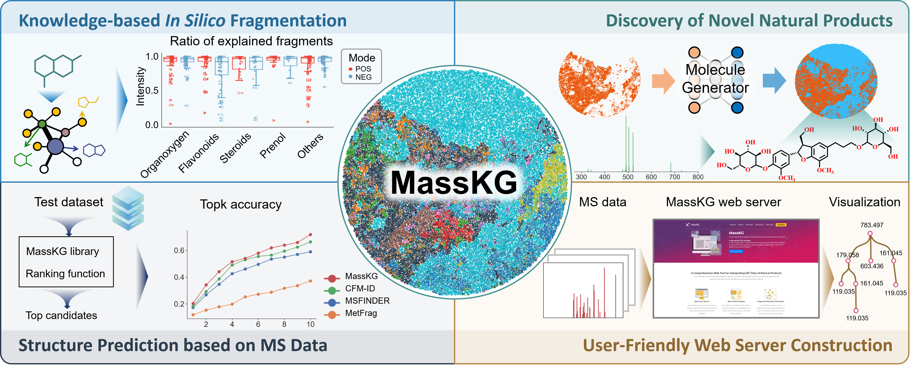

# MassKG v1.0 </a>

#  **Knowledge-based _In Silico_ Fragmentation and Annotation of Mass Spectra for Natural Products with MassKG**

### Bingjie Zhu,  Zhenhao Li, Zehua Jin, ..., Jie Liao*,Xiaohui Fan*

MassKG is a knowledge-based computational tool for annotating mass spectra of natural products and discovering novel structures from crude extracts.

## Requirements and Installation
This toolkit is written in Python programming languages. 
### Installation of MassKG (Python package)

           

# Introduction to MassKG

Liquid chromatography coupled with tandem mass spectrometry (LC-MS) is a powerful analytical technique used for the identification of metabolites from complicated sources. The general procedure for annotating mass spectrometry data is based on comparing experimental data with mass spectra of standard substance. However, currently, there are few reference LC-MS libraries for natural products due to their structural diversity, and publicly available mass spectrometry databases exhibit biases in terms of scale, coverage, and quality. Here, we propose MassKG, an algorithm that combines a knowledge-based fragmentation strategy and a deep learning-based molecule generation model to expand the reference spectra library of NPs with the more abundant chemical space. Specifically, MassKG has collected 407,720 known NP structures and, based on this, generated 266,353 new structures with chemical language models for the discovery of potential novel new compounds. Moreover, MassKG shows outstanding performance of spectra annotation compared to state-of-the-art algorithms, such as MSFINDER, CFM-ID, and MetFrag. To facilitate the usage, MassKG has been implemented as a web server for MS data annotation with a user-friendly interface, an automatic report, and the fragment tree visualization. Finally, the interpretation ability of MassKG is comprehensively validated through composition analysis and MS annotation of _Ginkgo Biloba_, _Codonopsis pilosula_, and _Astragalus membranaceus_.

* MassKG has been implemented at https://xomics.com.cn/masskg
* The chemical lauguage model please refer to https://github.com/skinnider/low-data-generative-models
* Complete TMAP of MassKG NP space ([Google Drive](https://drive.google.com/drive/folders/1U_ne24Be8vxwLpBZ_BHa-idXMowl0KMj))
## About
Should you have any questions, please feel free to contact the author of the manuscript, Mr. Bingjie Zhu (zhubj@zju.edu.cn).

## References

